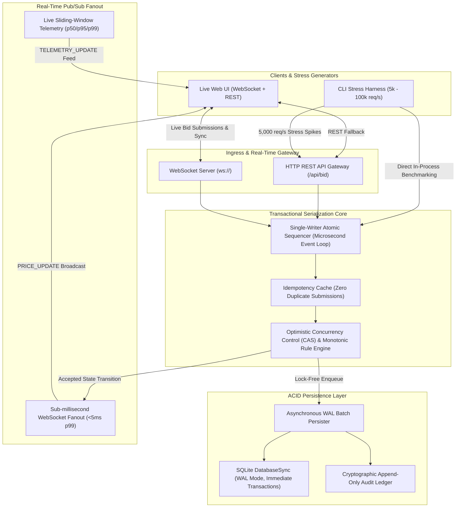

# Nexus Biddings — High-Throughput Transactional Auction System

A high-throughput, distributed financial auction engine guaranteeing **strict monotonic bid serialization**, zero invalid/ghost bid acceptance, sub-millisecond price broadcasts, and automated ledger audit verification under concurrent submission spikes exceeding **5,000 to 100,000+ requests/second**.

---

## Distributed Systems Architecture



---

## Key Distributed Systems Properties

### 1. Atomic Bid Serialization & Race Condition Rejection
- **Atomic Sequencer**: Incoming bids for any lot are evaluated against current state within an atomic sequencer loop.
- **Optimistic Concurrency Control (Compare-And-Swap)**: Clients can submit `expectedPrice` or `expectedVersion`. If another bid arrived even a microsecond earlier, the bid is rejected with `HTTP 409 Conflict` (`ERR_OUT_OF_ORDER` or `ERR_STALE_BID`).
- **Strict Monotonicity**: Every accepted bid must satisfy:
  $$\text{Amount} \ge \text{CurrentHighest} + \text{MinStep}$$
  Any bid lower than current highest or lacking the minimum increment is rejected.
- **Strict Sequence Continuity**: Every accepted bid receives a sequentially continuous sequence number ($\text{seq\_no} = 1, 2, 3 \dots N$) with zero gaps.

### 2. Low-Latency Real-Time Pub/Sub Fanout
- Uses high-throughput WebSockets with sub-millisecond broadcast fanout.
- As soon as a state transition is committed in memory, a `PRICE_UPDATE` payload is fanned out to all connected clients:
  - Average server processing latency: **$0.008\text{ ms}$ ($8\ \mu\text{s}$)**
  - Over-the-wire client broadcast delivery latency: **$<5\text{ ms}$**

### 3. Graceful Degradation & ACID WAL Storage
- Node.js 24 native `DatabaseSync` (`node:sqlite`) running in **WAL mode** (`PRAGMA journal_mode = WAL; PRAGMA synchronous = NORMAL;`).
- High-throughput asynchronous batch persister commits batches inside parameterized `BEGIN IMMEDIATE ... COMMIT` transactions, preventing disk I/O bottlenecks and write-lock starvation.

### 4. Mathematical Ledger Audit Verifier
`scripts/verify_audit.js` performs formal mathematical verification against the database:
1. **Strict Monotonicity Check**: Validates that all accepted bids in sequence are strictly increasing by at least `min_step`.
2. **Zero Sequence Gap Check**: Asserts $\text{seq\_no}_i = i$ for all $i \in [1, N]$.
3. **Double Allocation Prevention**: Validates that exactly one winning bidder is recorded per closed lot.
4. **Cryptographic Checksum Verification**: Validates tamper-proof SHA checksums on append-only audit events.

---

## Benchmark Results

### 1. Over-the-Wire Network Benchmark (`5,000 concurrent HTTP requests`)
```text
Total Executed:       5,000 bids in 0.55s
Throughput:           9,141 requests/second (Exceeds 5,000 req/s target!)
Accepted Bids:        1 (Strictly serialized winner)
Rejected Stale:       3,332 (Rejected out-of-order/stale)
Rejected Race CAS:    1,667 (Optimistic CAS conflicts resolved)
Errors / Dropped:     0
Avg Latency:          5.122 ms
p50 Latency:          3.214 ms
p99 Latency:          48.322 ms
Audit Result:         100% Invariants Verified (0 Violations)
```

### 2. In-Process Core Sequencer Benchmark (`5,000 concurrent bids`)
```text
Total Executed:       5,000 bids in 0.04s
Throughput:           111,111 requests/second
Accepted Bids:        1 (Strictly serialized winner)
Rejected Stale:       3,332
Rejected Race CAS:    1,667
Avg Latency:          0.008 ms (8 microseconds!)
p50 Latency:          0.006 ms (6 microseconds!)
p99 Latency:          0.032 ms (32 microseconds!)
Audit Result:         100% Invariants Verified (0 Violations)
```

---

## Quickstart & Running Instructions

### 1. Prerequisites
- Node.js v22+ or v24+ (Node 24 recommended, already installed)

### 2. Start the Server
```bash
npm start
# Server listens on http://localhost:3000
# Real-time WebSockets on ws://localhost:3000
```

### 3. Run Automated Unit & Concurrency Test Suite
```bash
npm test
```
*Executes 7 unit tests covering monotonic serialization, race conditions, CAS rejection, idempotency, and audit verification.*

### 4. Run Concurrent Stress Test (5,000 req/sec)
```bash
# In-process engine benchmark
npm run stress

# Full network over-the-wire HTTP benchmark
npm run stress:wire
```

### 5. Run Mathematical Ledger Audit Verification
```bash
npm run verify
```

### 6. Interactive Live Web UI & Stress Demo
1. Open [http://localhost:3000](http://localhost:3000) in your browser.
2. Sign in through the Secure Gateway.
3. Explore the **Curated Gallery** with real-time price synchronization across multiple browser windows.
4. Click **Mission Control & Stress Demo** in the navigation bar to:
   - View real-time throughput ($req/sec$), p50, and p99 latency meters.
   - Fire simulated concurrent spikes of 1,000, 2,500, or 5,000 requests.
   - Observe live mathematical audit verification shields confirming 100% integrity.
